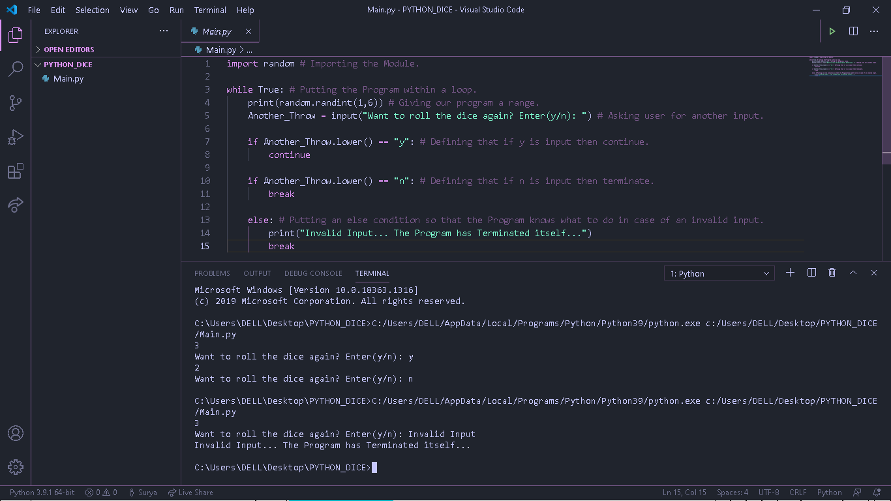

# Python_Dice
This is a Python Program that prints random numbers between 1-6 so you that's why I have named this Repository Python_Dice. It uses a built-in module named random for its functioning and this module would surely be present into your system as well if you have installed Python correctly. Below is the screenshot for my Project:

Hope that you like it.
